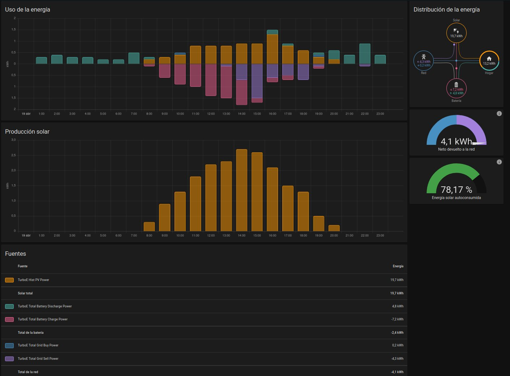
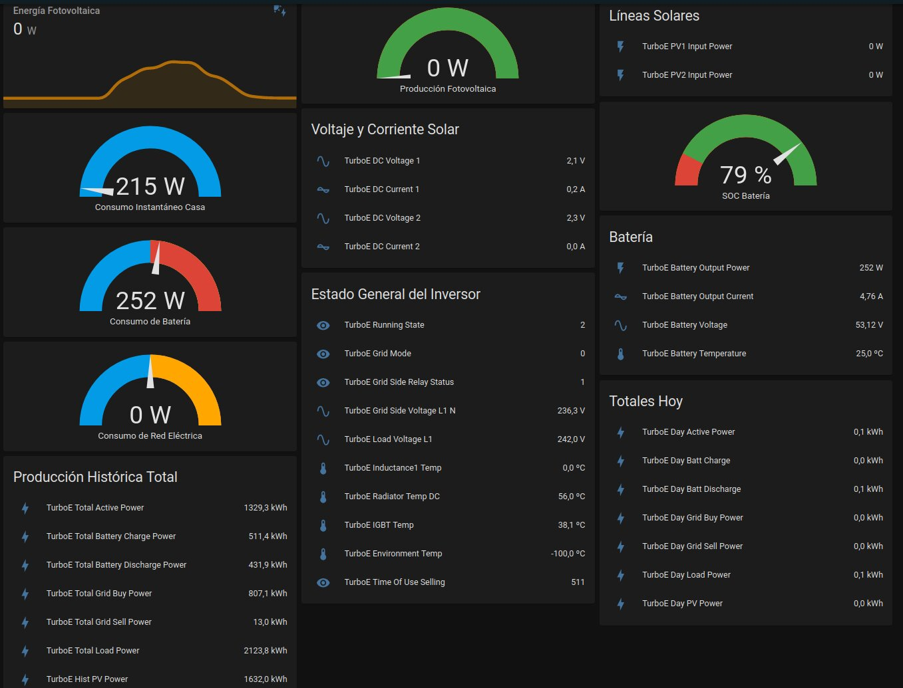

# turboenergysolarinverter

This Python script gets information from the inverter via rs485 serial line (Modbus RTU) and sends it to an MQTT broker.

More information about the serial connection at https://github.com/kellerza/sunsynk

Modbus TCP should work but has not been tested.

Tested on a Turbo Energy 5.5Kw

Should be compatible with Deye and Sunsynk versions.

Configuration:
   - Change MQTT Broker configuration
   - Change serial port
   - Change data rate

Tested on Linux. If you use Windows, you should change the serial por name:
   -  /dev/ttyUSB0 --> COM1
   -  /dev/ttyUSB1 --> COM2
   -  etc

Home Asisstant:
   - You need an MQTT Broker.
   - Add the content of the configuration.yaml to your Home Assistant configuration.yaml and restart.
   - Configure the Energy panel with the following entities:
      - TurboE Total Grid Buy Power
      - TurboE Total Grid Sell Power 
      - TurboE Hist PV Power
      - TurboE Total Battery Charge Power
      - TurboE Total Battery Discharge Power

Energy panel sample:

Sample panel with many cards:

